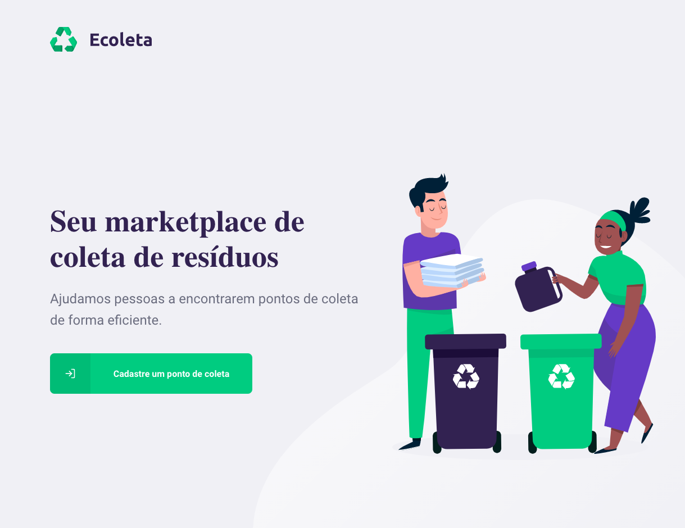

# Ecoleta Web
Ecoleta é um projeto da [NVW](https://nextlevelweek.com/) entre os dias 01/06/2020 até 07/06/2020, sobre uma aplicação que interliga o usuário com instituições de coleta de materiais recicláveis.

## Telas da aplicação:
Tela inicial da aplicação:


## Como executar o projeto:
Utilize o node na versão 12.16.3

Efetue o clone do projeto:
```bash
git clone https://github.com/Architect42/ecoleta-web.git
```

Acesse a pasta do projeto e atualize as dependências do projeto com o comando:
```bash
npm install
```

Comando para rodar o projeto:
```bash
npm run dev
```

## Extensões:
[React Developer Tools](https://chrome.google.com/webstore/detail/react-developer-tools/fmkadmapgofadopljbjfkapdkoienihi/related)

## Informações adicionais do projeto
Para a área de mapas foi utilizado uma lib publica de mapas chamada [leaflet](https://leafletjs.com/).

Para a lista de cidades e UF's foi utilizado a api de localidades do [IBGE](https://servicodados.ibge.gov.br/api/docs/localidades?versao=1).

Yup responsável por válidar os campos.
[yup](https://www.npmjs.com/package/yup)